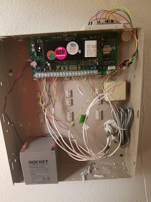
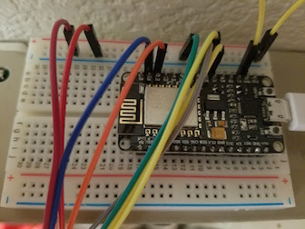
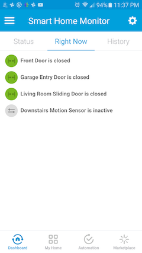
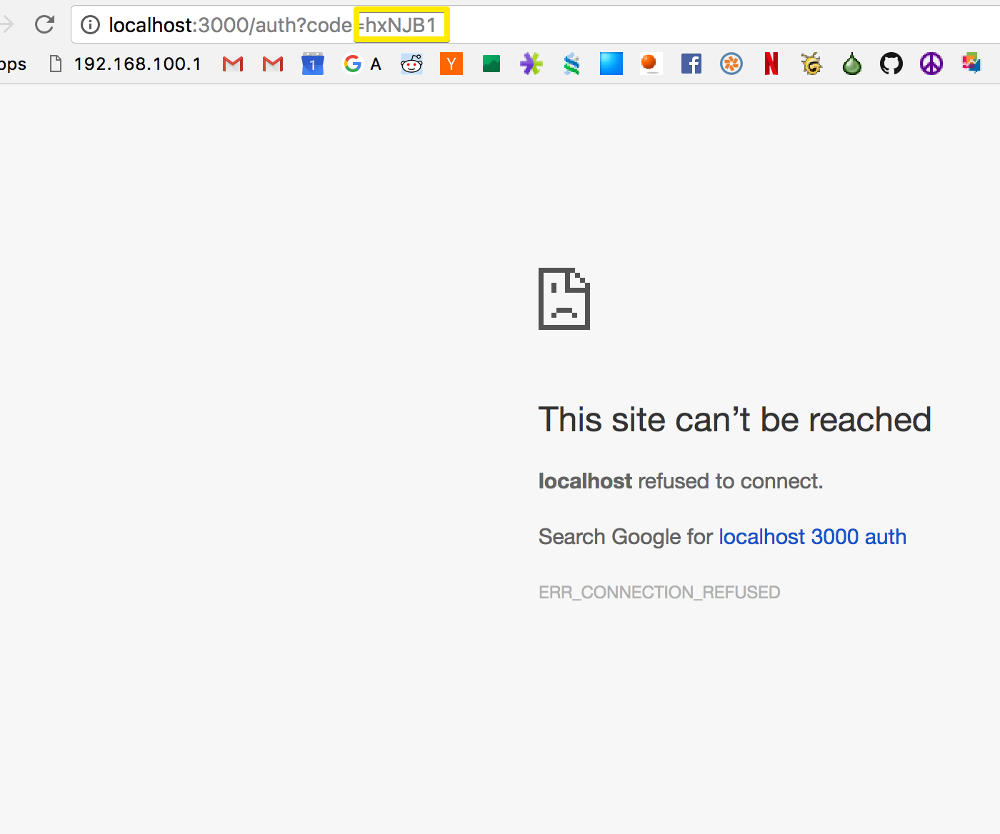
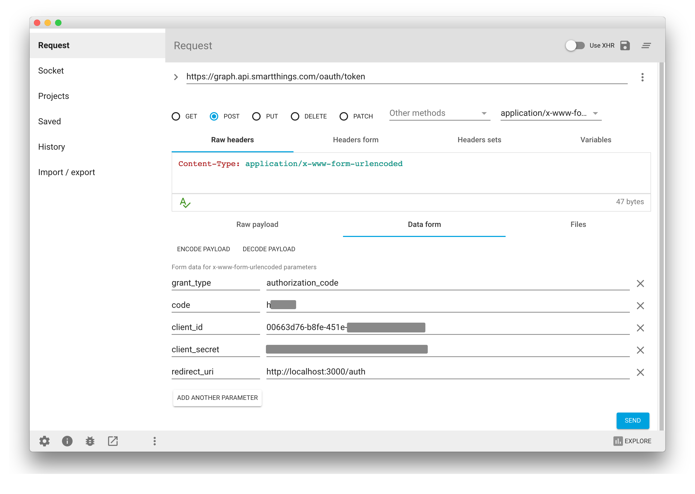
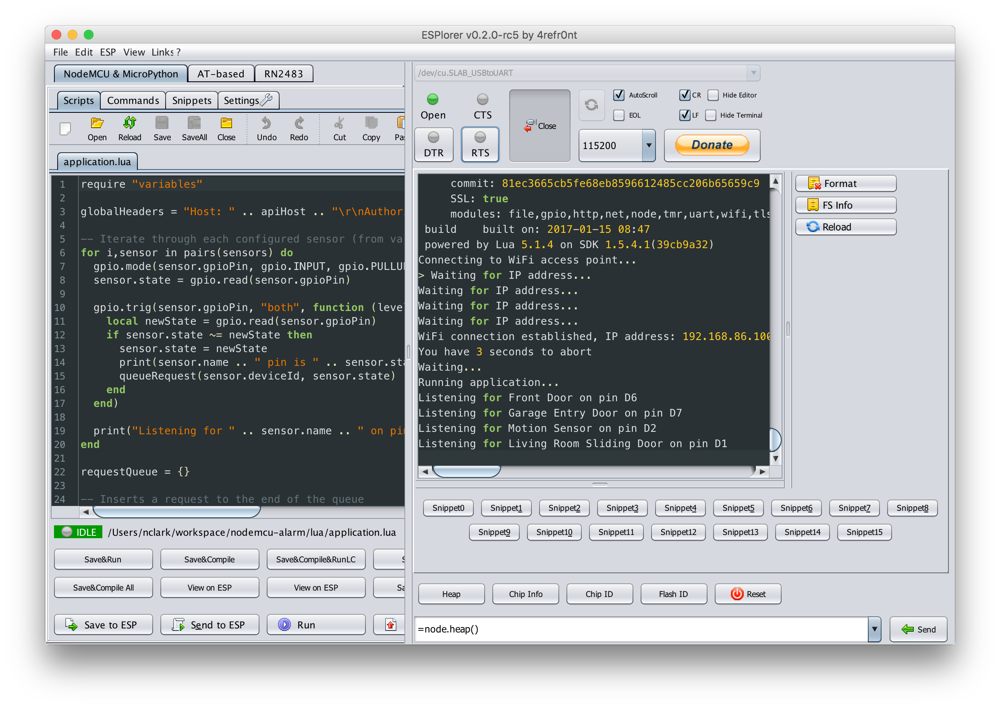

# SmartThings Connected Wired Security System using a NodeMCU ESP8266

This project will help you connect SmartThings to wired contact sensors (for doors and windows) and motion sensors that you may already have pre-wired in your home from a built-in home security system. There are three components to the project:

1. a SmartThings Device Hander for contact sensors and motion sensors
2. a SmartThings SmartApp that receives HTTP POST messages
3. Lua code for the NodeMCU device that connects your wired system to the cloud

### Background

The house I live in was built in the early 90s and came with a built-in home security system. I'm not interested in using the outdated alarm system panel, but I wanted to connect the contact sensors in my doors and the motion sensor in my house to SmartThings. I learned about the NodeMCU ESP8266, a small, cheap, programmable development board that has WiFi built in. I set out to connect my door and motion sensors to the NodeMCU and program it to update SmartThings every time a change is detected.

### Materials

1. A NodeMCU development board. [This is the one I bought on Amazon](https://www.amazon.com/gp/product/B010O1G1ES/ref=as_li_tl?ie=UTF8&camp=1789&creative=9325&creativeASIN=B010O1G1ES&linkCode=as2&tag=heythisisnate-20&linkId=2234c680df64af67b74eb313b8ca82df) for about $8 with Prime shipping. 
1. A [basic breadboard](https://www.amazon.com/gp/search/ref=as_li_qf_sp_sr_il_tl?ie=UTF8&tag=heythisisnate-20&keywords=B01N12ZULY&index=aps&camp=1789&creative=9325&linkCode=xm2&linkId=ea15eee83d4897e13cfab03e3ffea1b3).
1. Some [extra wires of various male/female combinations](https://www.amazon.com/gp/product/B01FSGGJLY/ref=as_li_tl?ie=UTF8&tag=heythisisnate-20&camp=1789&creative=9325&linkCode=as2&creativeASIN=B01FSGGJLY&linkId=c23cd9573b73d437a52781fee10722e6).
1. A [microUSB power supply](https://www.amazon.com/gp/product/B00GF9T3I0/ref=as_li_qf_sp_asin_il_tl?ie=UTF8&tag=heythisisnate-20&camp=1789&creative=9325&linkCode=as2&creativeASIN=B00GF9T3I0&linkId=72fc777b3abc63d2c2b86d1ff1343e18) or try one of these [other ways to power the device](http://henrysbench.capnfatz.com/henrys-bench/arduino-projects-tips-and-more/powering-the-esp-12e-nodemcu-development-board/)

_Update:_ Later on I saw [this NodeMCU board with a base](https://www.amazon.com/gp/product/B01MDTKAR2/ref=as_li_qf_sp_asin_il_tl?ie=UTF8&tag=heythisisnate-20&camp=1789&creative=9325&linkCode=as2&creativeASIN=B01MDTKAR2&linkId=f5b8649950c46c0644e88dfbace7567d) that looks like it eliminates the need for a breadboard. And [this kit](https://www.amazon.com/gp/product/B01N3KO7QV/ref=as_li_qf_sp_asin_il_tl?ie=UTF8&tag=heythisisnate-20&camp=1789&creative=9325&linkCode=as2&creativeASIN=B01N3KO7QV&linkId=d4335e6ef6331d73be4fa83bf3cfc338) also includes 40 jumper cables making it an attractive all-in-one starter set.

_Update 2:_ One user reported that he had success with [this board](https://www.amazon.com/gp/product/B01N3P763C/ref=as_li_qf_sp_asin_il_tl?ie=UTF8&tag=heythisisnate-20&camp=1789&creative=9325&linkCode=as2&creativeASIN=B01N3P763C&linkId=f546e4e49606dfb8ec7bd89b0cadfeb4) which has 7 GPIO pins available for connecting sensors. With the board I bought and linked above, I could only get 4 or 5 pins working reliably. This may be a good option if you have more sensors and don't want to set up multiple devices.

### Some photos

| a | b | c |
| --- | --- | --- |
|  |  |  |
|  I opened up the alarm panel and rerouted the wires for the sensors to the NodeMCU resting on top | Closeup of the NodeMcu | Devices in SmartThings |

## Step by Step Setup Guide

### 1. Getting Started

1. Clone or download this repository and open up the `lua` folder.
1. Copy or rename `variables.lua.example` to `variables.lua`
1. Copy or rename `credentials.lua.example` to `credentials.lua`
1. Open up `credentials.lua` in your favorite text editor and put in your WiFi SSID and password
1. Also open up `variables.lua`. We'll be completing this as we set up things in SmartThings.

### 2. Create Device Handler(s) in SmartThings

1. Log in to the [SmartThings IDE](https://graph.api.smartthings.com) -> My Locations -> click on your location
1. Go to My Device Handlers -> Create New Device Handler
1. Click the _From Code_ tab and paste the content of one of the device handlers and save:
  * [NodeMCU Connected Contact Sensor](https://raw.githubusercontent.com/heythisisnate/SmartThingsPublic/master/devicetypes/heythisisnate/nodemcu-connected-contact-sensor.src/nodemcu-connected-contact-sensor.groovy)
  * [NodeMCU Connected Motion Sensor](https://raw.githubusercontent.com/heythisisnate/SmartThingsPublic/master/devicetypes/heythisisnate/nodemcu-connected-motion-sensor.src/nodemcu-connected-motion-sensor.groovy)
1. Click Publish -> For Me
1. Repeat for the other device handler if you need both types


### 3. Create Devices in SmartThings

You'll need to create a device for each sensor that you plan on connecting. Repeat these steps for each sensor:

1. In the SmartThings IDE, go to My Devices
1. Click New Device and fill out the form giving your device a name like "Front Door"
1. In the Device Type dropdown, select either the _NodeMCU Connected Contact Sensor_ or _NodeMCU Connected Motion Sensor_ that you created earlier.
1. The Device Network Id doesn't seem to really matter, I just put a number.
1. Once you've created the device, make note of the device's URL. It will be something like `https://graph-na02-useast1.api.smartthings.com/device/show/22433333-1111-41dc-0000-00000000000`. The last part of the url is the DeviceId. Copy this DeviceId to the `variables.lua` file.

### 4. Create the SmartApp

The SmartApp receives data from your NodeMCU device, and updates the status of your devices in SmartThings.

1. Go to My SmartApps -> New SmartApp
1. Click the _From Code_ tab and paste the content of the SmartApp:
  * [Cloud Sensor](https://raw.githubusercontent.com/heythisisnate/SmartThingsPublic/master/smartapps/heythisisnate/cloud-sensor.src/cloud-sensor.groovy)
1. Once the SmartApp is created, click the edit icon or go to App Settings -> OAuth and enable OAuth and save.
1. Make note of the OAuth Client ID and Client Secret, you'll need these later.
1. Click Publish -> For Me

### 5. Generate an OAuth token

The OAuth token is used to sign HTTP requests from the NodeMCU to the SmartApp you just created. [SmartThings has documentation of this process here.](http://docs.smartthings.com/en/latest/smartapp-web-services-developers-guide/authorization.html). We'll be going through the OAuth flow manually to capture the token which can then be saved on the NodeMCU.

1. Copy and paste the below web address into your browser and replace `YOUR-SMARTAPP-CLIENT-ID` with the OAuth Client ID from the SmartApp created eariler.
   
   ```
   https://graph.api.smartthings.com/oauth/authorize?response_type=code&client_id=YOUR-SMARTAPP-CLIENT-ID&scope=app&redirect_uri=http://localhost:3000/auth
   ```
   
1. You'll see a page like this allowing you to authorize the devices you set up earlier:

   

1. Once you click Authorize, you'll be redirect to http://localhost:3000/auth which will error. That's ok! It wasn't supposed to work. All you need is the code out of the URL parameter:

   

1. Now that you've got the code, it's time to make a POST request to get the access token. For this I like to use [Advanced REST Client Chrome app](https://chrome.google.com/webstore/detail/advanced-rest-client/hgmloofddffdnphfgcellkdfbfbjeloo?hl=en-US). You can use any tool that can create a POST request with form parameters. Just fill in [the fields](http://docs.smartthings.com/en/latest/smartapp-web-services-developers-guide/authorization.html#get-access-token) as shown:

  

1. Click Send, and with any luck, you'll get a successful response back that contains your access token:

  

  Copy this access token into the `credentials.lua` file.

1. Finally, get your SmartApp endpoint by doing a GET request to `https://graph.api.smartthings.com/api/smartapps/endpoints`, signing the request with an `Authorization` header and your token:
  
    

1. Click send and make note of the url data returned:
  
  

  Copy the `base_url` field from here into the `apiHost` variable in the variables file
  Copy the `url` field into the `apiEndpoint` variable in the variables file, and add `/event` to the end

### 6. Flash the NodeMCU Lua firmware
1. Download and install the [USB to UART drivers from Silicon Labs](http://www.silabs.com/products/mcu/pages/usbtouartbridgevcpdrivers.aspx)
1. The [firmware](firmware/nodemcu-master-9-modules-2017-01-15-08-48-34-integer.bin) contained in this repo is a recent build from https://nodemcu-build.com/ with following packages: `file`, `GPIO`, `HTTP`, `net`, `node`, `timer`, `UART`, `WiFi` and `TLS/SSL support`. This firmware is on SDK version 1.5.4.1. Between the time that I did this project and wrote up this README, the NodeMCU firmware team has released a 2.0.0 firmware, which some have reported problems with my lua code. I have not had time yet to debug these issues, so for now I suggest using this slighly older firmware (from Jan 15, 2017) version.
1. I used [esptool.py](https://github.com/espressif/esptool) to flash the firmware (I'm using a Mac). There's pretty good [documentation here](https://nodemcu.readthedocs.io/en/master/en/flash/) including a couple other options for Windows users.
1. The exact command I used to flash the firmware is:
  
  `./esptool.py --port=/dev/cu.SLAB_USBtoUART write_flash 0x00000 firmware/nodemcu-master-9-modules-2017-01-15-08-48-34-integer.bin`

  Your port may vary depending on your platform (I'm using a Mac)
 
### 7. Load up the NodeMCU ESP8266

1. Download [Esplorer](https://esp8266.ru/esplorer/). It's a cross-platform IDE for interacting with the NodeMCU. _Very_ handy.
1. Plug a microUSB cable into the NodeMCU and the other end into your computer, open up Esplorer, select the USBtoUART from the serial port chooser, set the baud rate to 115200, and click Open to connect. You may need to click the RTS button a couple times to connect and see something like this:

  

1. Once connected, it's time to upload the code. Click Open in Esplorer and open each of the lua files on your computer and click "Save to ESP". Alternatively, you can use the Upload button to upload them all at once. [This documentation](http://esp8266.ru/download/esp8266-doc/Getting%20Started%20with%20the%20ESPlorer%20IDE%20-%20Rui%20Santos.pdf) was also very helpful in learning how to interact with the device using Esplorer.
1. After all the code is uploaded, click the Reset button to restart the device. It should boot up, connect to your WiFi and output a message for each configured sensor, like this:

  

1. Now let's test it out! The first sensor in this example is configured on pin 6 (labled D6). Take a wire and connect one end to pin D6 and the other end to the ground (GND). This completes the circuit, setting the pin low or 0, indicating that the contact sensor is closed. Hopefully it worked and you should see a success message in the Esplorer terminal, and when you open your SmartThings app you should see that the door is closed. Now remove the wire and watch it set to open.
1. _Note about the pins:_ I found that some of the pins don't work very well when normally _low_. It took a lot of trial and error to figure out that pins D1, D2, D6 and D7 worked reliabliy for me. I had problems with D3, D9 and D10. Your mileage may vary.

### 7. Connect your switches at the alarm panel

1. Open up your alarm panel and find the cluster of wires coming from the switches throughout your house. Hopefully they're labeled well, otherwise you'll have some testing to do. Using some jumper cables, connect each pair of wires from each switch to the corresponding pin and ground on the board.
1. Now go around your house testing it out!
1. Once everything is working properly, you can plug the NodeMCU into a standard USB power adapter and it will automatically boot up, connect to WiFi, and start listening for switches.

## Problems or Questions

Please [open an issue](https://github.com/heythisisnate/nodemcu-smartthings-sensors/issues) if you run into problems or have feature requests. You can also [join the discussion on SmartThings community](https://community.smartthings.com/t/connect-wired-alarm-system-sensors-to-smartthings-with-a-nodemcu-esp8266/76010)

[](https://ga-beacon.appspot.com/UA-641236-8/nodemcu-smartthings-sensors)
